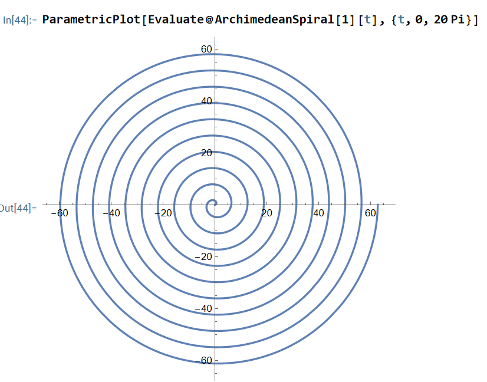
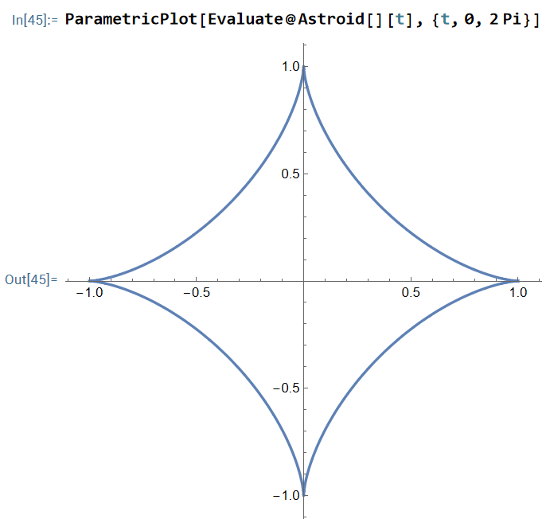
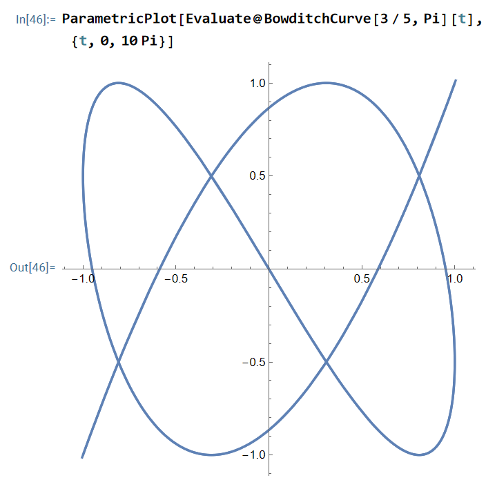
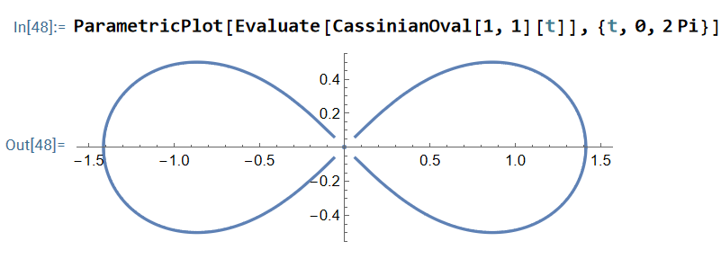
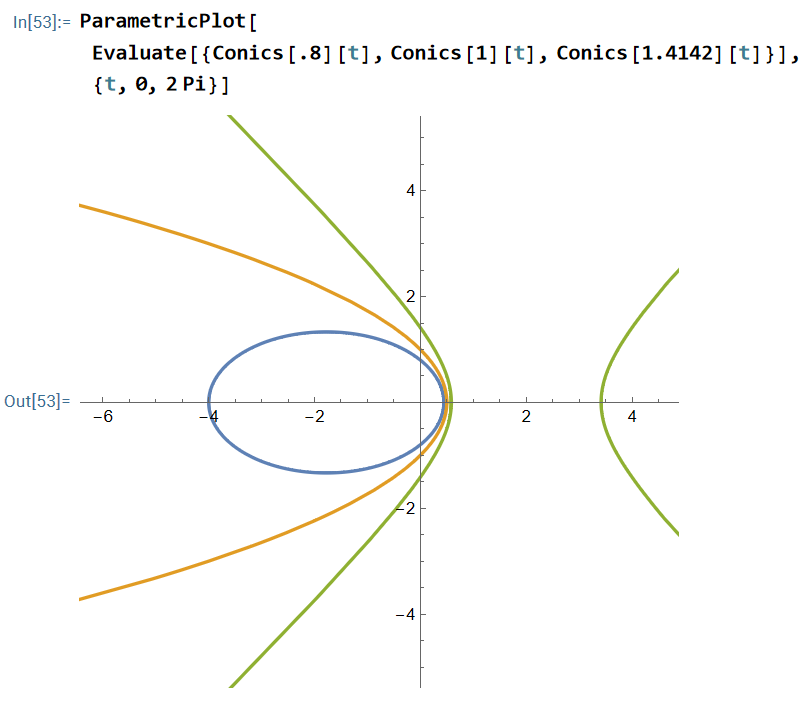
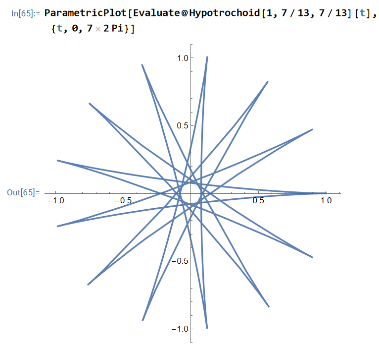
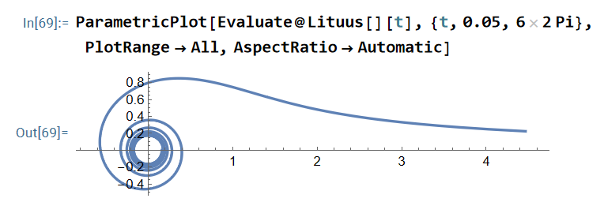

PlaneCurveFormulas.wl is a package for Wolfram language / Mathematica.

It is basically a collection of parametric equations for named plane curves, so that you can type a curve by name instead of remembering its formulas.

PlaneCurveFormulas.wl
is the code.

PlaneCurveFormulas_examples.nb
is the documentation.

All exported symbols are fully documented. e.g.
Type
?name
for documentation.

Home page url:
http://xahlee.info/M/plane_curve_formulas.html

This package is sponsored by Wolfram Research.

# gallery

